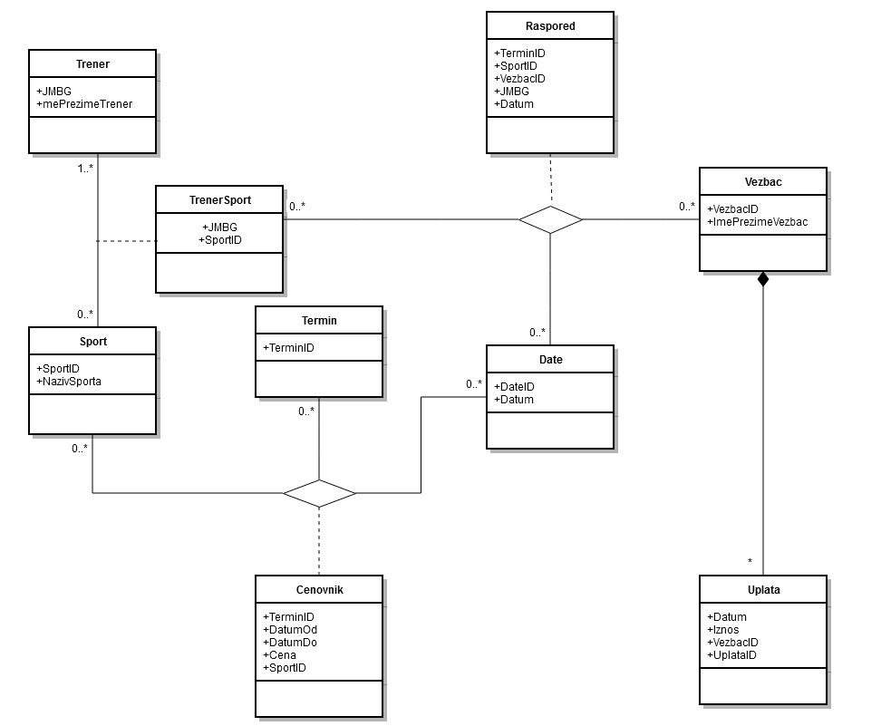
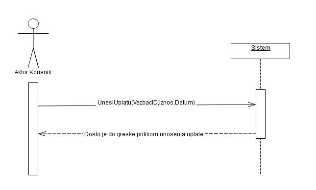
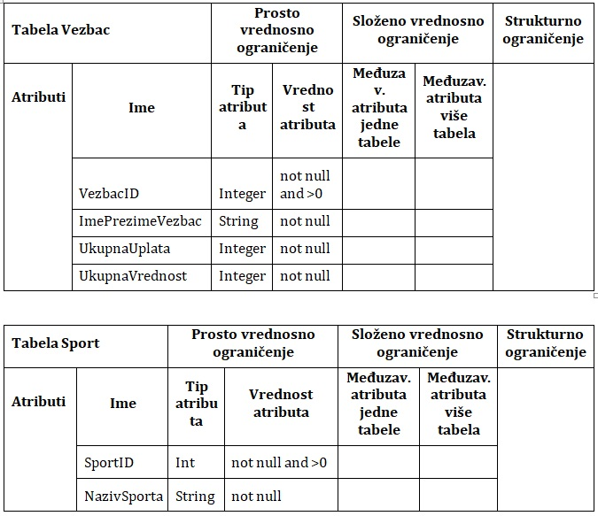

# Sports Club Information System

## 🌟 Overview
A C# desktop application designed to manage athlete records, payments, and schedules for a sports club. This project features a multi-tier architecture using a **Web Service** for database communication.

## 📸 Screenshots


## 🛠 Tech Stack
* **Language:** C# (.NET)
* **Database:** Microsoft Access (.accdb)
* **Architecture:** Client-Server via Web Services
* **Data Handling:** StreamBuffers and LINQ
* 

## 📊 Design & Logic (UML)
The system follows a modular Object-Oriented design, as seen in the Class Diagram below. It utilizes a Web Service layer to decouple the UI from the MS Access data persistence.




## ⚙️ Setup & Configuration
This project uses a modular architecture where the client communicates with a database through a **Web Service**. 

To initialize the system, you must configure the database connection string in the `WebServis` project configuration file.

> **Note for Serbian speakers:** > *Da bi program proradio unesite konekcioni string baze podataka u konfiguracionu datoteku projekta WebServis!*

**Connection String Example:**
In your `App.config` or `Web.config`, ensure the path points to your local `.accdb` file:
```xml
<connectionStrings>
  <add name="SportsClubConn" 
       connectionString="Provider=Microsoft.ACE.OLEDB.12.0;Data Source=|DataDirectory|\SportsClub.accdb;" />
</connectionStrings>
```


## 📁 Documentation
The full project documentation (including detailed requirements and system analysis) is available in Serbian:
* [Download Project Documentation (PDF)](./docs/Documentation.pdf)
