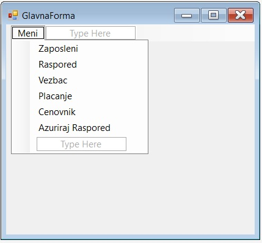
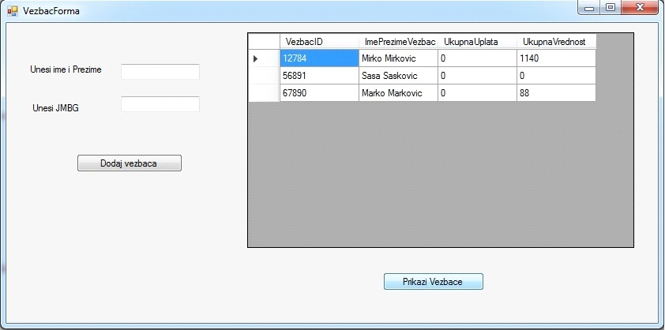
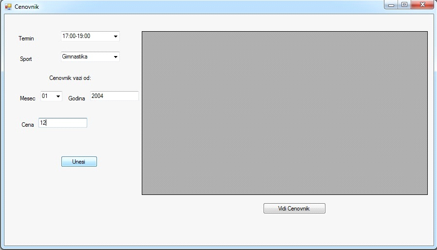

# Sports Club Information System

## 🌟 Overview
A C# desktop application designed to manage athlete records, payments, and schedules for a sports club. This project features a multi-tier architecture using a **Web Service** for database communication.

## 📸 Screenshots

## 🛠 Tech Stack
* **Language:** C# (.NET)
* **Database:** Microsoft Access (.accdb)
* **Architecture:** Client-Server via Web Services
* **Data Handling:** StreamBuffers and LINQ

## 📊 Design & Logic (UML)
*Include your Use Case or Class Diagram here*

## 📁 Documentation
The full project documentation (including detailed requirements and system analysis) is available in Serbian:
* [Download Project Documentation (PDF)](./docs/dokumentacija.pdf)
